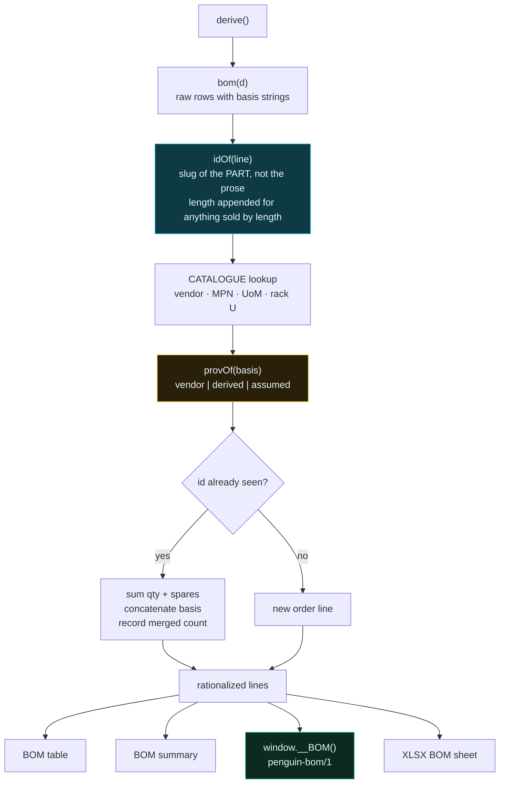

# The BOM, and how it reaches a purchase order

A bill of materials made of display strings is a document. A bill of materials with stable
part identity, a vendor, a unit of measure and a provenance flag is an **input to an
ordering system**. This one is built to become the second thing.

## What was wrong

`bom()` returned `{cat, item, qty, sp, basis}` — prose, no identity. Two rows describing
the *same part* in different words sat apart, which is how a purchase order ends up with
two lines for one SKU and a receiving dock that cannot check the pallet against it.

On the stock GB300 build that was literally true: two separate `MPO-12/APC jumper 15m`
lines, 6,912 and 4,896. Same part. Same length. Two lines.

---

## The pipeline



### Identity

Derived from the part, not the sentence describing it. **Length is part of identity** for
anything sold by length — merging a 5 m and a 50 m trunk would be a wrong PO — so those
carry it: `mpo-12-apc-jumper@15m`.

### MPN may be `null`, and that is load-bearing

Where no part number is published — Penguin nodes, cut DAC lengths, rack enclosures — the
field is **null**, not a guess.

An invented part number is the most expensive kind of wrong available in this file: it
looks orderable and is not. `unquotable` counts these at the envelope level so an
integration can gate on it instead of silently emitting PO lines with an empty part field.

### Provenance defaults to `derived`

The first cut defaulted to `vendor` whenever a basis string carried no marker, which
upgraded a line to "the vendor published this" purely by being terse. Silently defaulting
to the **stronger** claim is precisely the failure this whole codebase exists to stop.

A `vendor` classification now has to be earned by citing a vendor source:

```
ASSUMED | NOT PUBLISHED | EXTRAPOLATED | UNVERIFIED   → assumed
DERIVED | OURS                                        → derived
RA Table | NVIDIA RA | VENDOR-PUBLISHED | published row → vendor
anything else                                         → derived
```

Sanity check that it is not stuck on one value: a GB300 build returns 8 vendor / 15 derived
/ 1 assumed; a Relion build returns 23 derived. Both are correct — on a Relion the fabric
is ours too.

---

## BOM summary

The line list answers *what do I order*. It does not answer the questions asked in the ten
minutes after someone reads it. The summary does, from the **same rationalized lines** —
never a second computation, because a summary derived independently is a summary that can
disagree with the thing it summarises.

Four headline numbers:

| | |
|---|---|
| **order lines** | and how many were merged from duplicates |
| **total order quantity** | qty + spares, because that is what goes on the PO |
| **lines needing a vendor lookup** | no published part number — not blocked, not orderable as-is |
| **consistency failures** | if non-zero, this build is not quotable |

Then three cuts: **by vendor** (one PO each), **by category**, and **by provenance** — the
last one spelling out what each class means for a quote. Lines with no part number are
named explicitly at the bottom, so you know before you send the PO rather than after.

---

## The order-system seam

`window.__BOM()` and the **⬇ BOM for ordering (JSON)** button emit a versioned envelope,
deliberately in the same shape as the `penguin-config/1` file saved configurations already
use — one convention to learn, and a version field to branch on when it changes.

```jsonc
{
  "format": "penguin-bom/1",
  "version": 1,
  "generated": "2026-08-10T…",
  "identity": { "partner": …, "customer": …, "project": … },

  "build": {
    "architecture": "relion-xe4418",
    "label": "Penguin Relion XE4418GTS-DTC",
    "provenance": "derived",
    "basis": "DERIVED — rack composition is OURS, sized on racks from published node figures. NOTE: Penguin Solutions publishes a scalable unit …",
    "gpus": 4664, "computeRacks": 53, "totalRacks": …,
    "nodesPerRack": 11, "gpusPerRack": 88, "rackKw": 154,
    "boundBy": "space-limited",
    "scalableUnits": null,              // null unless the vendor publishes one
    "feed": { "id": "415-3-300", "label": "415 V 3φ 300 A", "kw": 169.1,
              "connector": "busway tap-off", "perRack": 1, "mode": "capacity" },
    "fabric": { "derived": true, "basis": "DERIVED (OURS) — …",
                "ibLeaf": 72, "ibSpine": 36, … }
  },

  "consistency": {
    "fail": 0, "warn": 1,
    "quotable": true,                   // gate on this
    "rules": [ { "id": "V2", "category": "Provenance", "verdict": "WARN", … } ]
  },

  "unquotable": 16,                     // lines with mpn: null

  "lines": [
    {
      "id": "q3400-rd-quantum-x800-ib-leaf",
      "catalogueId": "q3400-rd",
      "category": "Switch",
      "description": "Q3400-RD Quantum-X800 — IB leaf",
      "vendor": "NVIDIA",
      "mpn": "Q3400-RD",                // null where none is published
      "uom": "ea",
      "rackU": 4,
      "qty": 72, "spares": 4, "orderQty": 76,
      "provenance": "derived",
      "mergedFrom": 1,
      "basis": "DERIVED (OURS) — ceil(compute links / 72 downlinks), …"
    }
  ]
}
```

### What an integration should do with it

1. **Refuse on `consistency.quotable === false`.** A build that fails an electrical or
   cable-reach check should not become a quote. The verdicts ship inside the envelope
   precisely so this can happen upstream of a buyer.
2. **Route `unquotable` lines to a vendor lookup** rather than emitting them with an empty
   part field.
3. **Treat `provenance` as a confidence gate.** `vendor` lines can be quoted against
   directly. `derived` lines are defensible arithmetic and not a vendor commitment.
   `assumed` lines are placeholders and should be replaced with a measured or quoted
   figure.
4. **Key on `id`, not `description`.** Descriptions carry architecture labels and will
   change wording; ids are stable and already de-duplicated.

---

## The XLSX BOM sheet

Worth naming, because it was broken and looked fine. The workbook's BOM sheet read
`r[0]..r[3]` off objects, so every cell came out `undefined` and it shipped a **header row
over blank cells**. It looked like a BOM, which is why nobody caught it.

It now carries the full order shape — part id, category, item, vendor, MPN (or
`NOT PUBLISHED — vendor lookup required`), UoM, qty, spares, order qty, provenance, merged
count, basis — and the workbook styler colours anything ours, assumed, extrapolated,
derived or unverified **amber**, so a reader scanning a spreadsheet cannot mistake it for a
vendor figure.

---

## Verifying it

`scripts/probe-bom.mjs` prints the table an ordering system would receive and asserts the
properties that make it orderable:

```
node scripts/probe-bom.mjs --arch relion-xe4418 --feed 415-3-300
```

- ids are unique — a duplicate means rationalization failed, which is two PO lines for one part
- every line has a vendor, a UoM, and `orderQty === qty + spares`
- `provenance` is one of the three legal values
- `mpn` is `null` rather than `undefined` where unpublished
- **no derived line cites an NVIDIA RA table** — the same claim rule V1 makes, checked from
  outside the app
