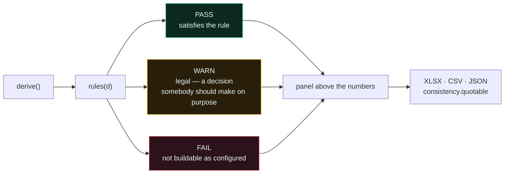

# Business rules

Every number in this tool is arithmetic on somebody's datasheet, and arithmetic will
happily produce a rack that cannot be energised, a DAC that cannot reach, or a fabric with
more links than the leaf has ports. The model has always *encoded* these limits. Until
`e357a97` it never *checked* them — so a violation looked exactly like a valid design.

21 rules now run on every repaint and travel with the model into every export.

**18 evaluate on every build.** Three are conditional, because a rule that cannot apply
should not occupy a row: **E5** only when an ORv3-class platform or the 48 V DC feed is in
play, **C4** only in top-of-rack mode, **V2** only on a derived build. So a typical panel
shows 19–21 rows, not always 21.

## A rule that cannot fail is decoration

Same doctrine as `assert-controls-move-the-model.mjs`, one layer up: *a checker whose
output never varies is the bug.* So `scripts/assert-model-consistency.mjs` does two jobs —
it sweeps 48 configurations for coherence, and it **provokes** each rule with inputs chosen
to break it, asserting the rule actually reports it.

This is not theatre. It has already caught four real defects:

| Provocation | Found |
|---|---|
| Cat6A at a 200 m tray rise | the original C5 checked BMC runs, which are fixed at 3 m in-rack — it could **never** fail |
| DGX B300 packed dense | E4 read the word "liquid" in `"air/liquid"` and passed any density silently |
| ToR with 8 rails | the harness itself was setting `.value` on a `
` and testing the default configuration |
| Dell NVL72 | V1 keyed on rack provenance, so it reported an **honest** RA citation as laundering |

---

## Electrical

### E1 — rack load ≤ feed capacity
`archSpec().rackKw ≤ feedKw`, at an 80% continuous derate. This is the invariant nodes per
rack is built on, so it should normally pass by construction — it fails when a **rack-scale**
SKU's vendor-fixed draw exceeds the feed you chose.

> **Proven able to fail:** GB300 NVL72 draws 142 kW. 415 V 3φ 250 A derates to 140.9 kW.
> 1.1 kW short is still short.

### E2 — capacity feeds sum, redundancy feeds do not
Under **2N** each path carries the whole load alone, so two 250 A feeds give 140.9 kW of
capacity, not 281.8. Under capacity mode they sum, and losing one loses that share of the
rack — which is not redundancy. Conflating the two is how a rack gets commissioned onto a
breaker that trips.

### E4 — cooling vs density
Practical ceiling for contained air with a rear-door exchanger is ~**40 kW/rack**.

Three states, not two, because several platforms ship air **or** liquid:

| Cooling string | Above 40 kW/rack |
|---|---|
| pure liquid / DTC | **PASS** — it is built for this |
| `air/liquid` (e.g. DGX B300) | **WARN** — you are committing to the DTC variant, and with it a coolant loop, a CDU and a facility water tie-in. Price the liquid SKU. |
| pure air | **FAIL** — not deliverable |

### E5 — ORv3 busbar
OCP Open Rack v3's **base** specification is a 48 V busbar rated around 18 kW. Vendor racks
quoting 300 kW+ are ORv3-*inspired*, not base-spec. **Do not size a busbar from the OCP
document.** Raised as a WARN whenever an ORv3-class platform or the 48 V DC feed is in play.

---

## Network

| Rule | Checks | Fails when |
|---|---|---|
| **N1** | IB leaf downlink capacity ≥ compute links presented (`leaf × 72`) | links have nowhere to land |
| **N2** | rail optimisation — leaf count is a whole multiple of `rails` | ToR with >1 rail, or a leaf count that splits a rail |
| **N3** | blocking ratio from `ibUplinksPerLeaf` against 72 downlinks | WARN off 1:1 — deliberate oversubscription, saves optics, costs bandwidth |
| **N4** | endpoints ≤ fabric ceiling | 9,216 (NVIDIA RA, 16 SU) or 10,368 (ours, 144²/2) |
| **N5** | spine layer present only when leaves exceed one layer | informational — a spine with nothing to join is cost with no topology |
| **N6** | OOB ports ≥ BMC ports, and the SN2201 uplink is claimed **exactly once** | the double-count the port-topology fold caught |
| **N7** | patch positions ≥ MPO positions a pod presents | panels terminate MPO *positions*, not fibres |
| **N8** | trunk offered load ≤ the load cap (default 80%) | a trunk at 100% has no margin for a failed strand or a rebalance |

**N2 in full**, because it is the one that surprises people: a rail-optimised fabric groups
the *same rail* from many nodes onto one leaf. Doing that top-of-rack needs one leaf **per
rail in every rack** — eight switches a rack for an 8-GPU HGX node — or you give up rail
optimisation. This is why NVIDIA's RA does not use ToR at SuperPOD scale. ToR is right for
smaller builds and wrong for the reference architecture.

---

## Cable length

| Rule | Limit | Notes |
|---|---|---|
| **C1** | longest computed reach ≤ **500 m** stock ceiling | past this the BOM would silently round to 500 m and hand you a cable that does not arrive |
| **C3** | optical runs ≤ **500 m** | MMS4X00-NM DR8 is a 500 m part. Row run + tray rise + inter-floor riser all count against it. |
| **C4** | top-of-rack run ≤ **2 m** | only raised in ToR mode. Asserts the saving is real — an in-rack passive DAC — and not just a shorter number. |
| **C5** | OOB uplink ≤ **30 m** SFP28 AOC | past DAC (~5 m) and past AOC, the BOM's "SFP28 DAC/AOC" line is the wrong part and the uplink needs optics |
| **C6** | tray rise counted on every non-ToR horizontal run | zero rise understates every reach in the BOM |

C5 is the honest replacement for a rule that could never fail. Cat6A's 100 m channel is
real, but BMC and console runs terminate on the in-rack OOB switch at 3 m, so no input
could ever breach it. The copper run that genuinely varies is the OOB switch's own uplink
to aggregation.

---

## Physical

**P1 — rack U.** `nodes × nodeU + fixedU ≤ usableU`, where usable is rack height less
reserved U. For rack-scale the cabinet is the SKU and its contents are vendor-fixed.

**P3 — ASHRAE TC9.9 aisles.** WARN below 1.2 m cold (front-to-front) or 0.9 m hot
(back-to-back). Below that you are trading service access and recirculation margin for
floor area — a decision, not an oversight.

---

## Provenance

### V1 — no laundering
No BOM line may cite an NVIDIA reference-architecture table when the fabric was computed by
us. This is the issue's core constraint made executable rather than left to a reviewer's
eye.

Scoped to the **fabric**, deliberately. Dell's XE9712 is Dell's cabinet running NVIDIA's
genuinely published NVL72 SuperPOD fabric; keying this on the *rack's* provenance reported
an honest citation as laundering. The precise rule: **an RA table may be cited only when
the counts were read from one.**

### V2 — not a vendor-blessed configuration
Raised on every derived build, and worded differently by shape because the derived part
differs:

- **Node builds** — *"11 × Penguin Relion XE4418GT per rack at 154 kW is OUR arithmetic on
  published datasheet figures — 4U per node, 14 kW per node, 8 GPU per node — bounded by
  the 415 V 3φ 300 A feed you selected."*
- **Rack-scale** — the cabinet is the vendor's and fixed; what is ours is the multi-rack
  grouping, NVIDIA's SU figure applied to another vendor's cabinet.

Both end the same way: the vendor publishes **validated configurations** — specific node
counts, cooling loops and fabric layouts they will support — and this tool does not have
that list. Sizing-grade only. Confirm before it becomes a quote.

---

## Known gap — three rules the design named and does not implement

The design for this work listed three further checks. They are **not implemented**, and the
ids are left unused rather than renumbered so this table stays honest:

| id | Would check | Why it is not there yet |
|---|---|---|
| **E3** | a rack-scale SKU is purchased whole — flag a partial NVL72 | `partial` already exists in the Size It `size()` function but is not surfaced as a rule in the Advanced planner |
| **C2** | media class vs reach — passive DAC ≤ 2 m, ACC ≤ 3 m, AOC ≤ 5 m, else optics | `media()` already selects correctly; the rule would assert nothing downstream overrode it |
| **P2** | the floor closes on metres — rows × row pitch + terminating aisle = stated depth | the geometry is computed and rendered but not asserted |

Each is a few lines. They are listed here rather than quietly dropped because a rule set
that documents 24 checks and runs 21 is exactly the kind of gap this tool exists to catch
in other people's numbers.

---

## Reading the panel

Sorted FAIL first, then WARN, then PASS — you should not have to hunt for the thing that
blocks the build. Each row carries the rule id, its category, the comparison in numbers,
and the reasoning.

`window.__ADV_MODEL().rules` and `window.__BOM().consistency` carry the same verdicts, so a
downstream system can gate on `consistency.quotable` rather than re-deriving the checks or
discovering the problem at commissioning.
