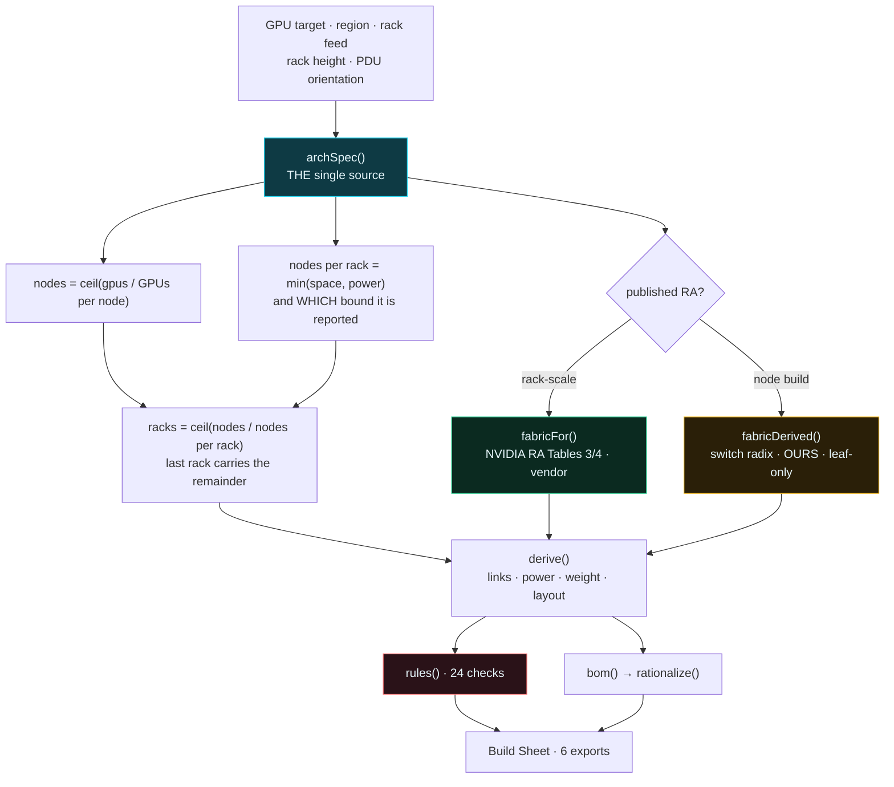
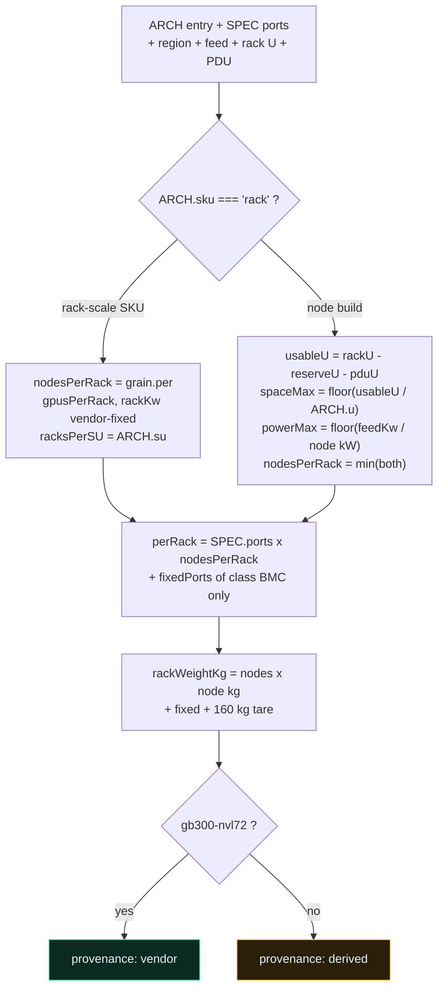

# The model — how a GPU target becomes a bill of materials

## What this sizes

A **Penguin Solutions AI pod**. You give it a GPU count, a region, a rack feed and a rack
height; it gives you nodes, cabinets, PDUs, fabric, cables, the management plane, and a
parts list you can send somewhere.

It is built around a repeatable order motion. The 512-GPU RFQ that shaped it —
*64 nodes, NVL8 racks due to load limits, non-blocking line-rate InfiniBand back-end,
dedicated front-end for storage access, OOB cluster management, 1.2 MW room* — is the
default when you open the page.

---

## Top-level flow



---

## `archSpec()` — the single source

Before `e357a97` the planner took an architecture and used it for a vendor tag and a label
while every number downstream — 8 racks per SU, 72 GPU and 142 kW a rack, a literal
`{compute:72, storage:36, bmc:27, mgmt:18}`, 4 rails — was a GB300 NVL72 constant. Building
a Penguin Relion returned an NVL72 floor plan with Penguin's name on it.

Everything now comes from one object.



### Non-regression anchor

For `gb300-nvl72` this reproduces the constants it replaced exactly — 18 trays, 72 GPU,
142 kW, 8 racks/SU, 4 rails, `{72, 36, 27, 18}`. `scripts/adv-fingerprint.mjs` diffs it.

Two subtleties that each cost a bug:

`perRack` folds `SPEC.fixedPorts` **for class `bmc` only** — the fixed `mgmt` entry is the
in-rack OOB *uplink*, which `derive()` already counts as `oobUp`. Folding both bills it twice.

`nodeU` is the height of what the rack is **full of** — `SPEC.nodeU` (1U) for a rack-scale
tray, `ARCH.u` for a node. Reading `ARCH.u` for rack-scale gives 48, the *cabinet* height,
which made rule P1 compute 18 × 48U into a 44U rack.

---

## Round to nodes, not to racks

The planner used to compute racks from the GPU target and multiply back, forcing every rack
full. 512 GPUs on a feed holding 10 nodes a rack returned **560** — six nodes nobody ordered.

That is the floor-tile rounding the Size It tab exists to expose, being done quietly by the
planner. A rack-scale SKU genuinely is bought whole; a 4U node is not, and a partially
populated cabinet is the normal end of a row.

| Feed | | Delivered |
|---|---|---|
| 300 A | 11/rack × 6 racks, last rack 9 | **512** |
| 250 A | 10/rack × 7 racks, last rack 4 | **512** |
| 200 A | 8/rack × 8 racks, exact | **512** |

The cable plant follows **installed nodes**, not racks × a full-rack port count — otherwise a
partial rack bills optics and panels for nodes that are not there.

---

## Region sets the voltage and the plug

A rack feed is not a universal quantity.

```
amps    = kW × 1000 / (V × √3 × pf)     ← calc(), unchanged
breaker = nextBreaker(amps / 0.8)       ← 80% continuous derate
──────────────────────────────────────────────────────────────
kW      = A × 0.8 × V × √3 × pf         ← the ladder, inverted
```

Same relation both directions, so the two planners cannot disagree about what a 250 A feed
carries. `pf = 0.98`, derate `0.8`. Six regions — NA 480 V, EU 400 V, UK/ANZ/India 415 V,
Japan 200 V — each naming its three-phase and single-phase connector standards.

The same 200 A breaker, same 512 GPUs:

| Region | Feed | Nodes/rack | Racks |
|---|---|---|---|
| UK 415 V | 112.7 kW | 8 | 8 |
| North America 480 V | 130.4 kW | 9 | 8 |
| Europe 400 V | 108.6 kW | 7 | **10** |

**Data-centre UPS is assumed upstream.** This models the rack feed from the PDU back to the
busway; ride-through, generator and switchgear are the facility's.

---

## Fabric: leaf only at pod scale

A single scalable unit needs no spine — every rail is one hop inside the unit, and NVIDIA's
own RA narrative says so for the 1-SU case. The IB side already knew this. The Ethernet side
did not, and emitted a spine for every three leaves, so a 576-GPU pod was quoted three
SN5600D spines it cannot use.

Leaf-only is the default. Leaf + spine is one selector away, and rule **N5** checks the
choice rather than agreeing with it — a leaf count exceeding the rail grouping has cross-leaf
traffic with nowhere to go, and that FAILs.

Derived radix arithmetic, stated so it can be argued with:

- **IB leaf** = `ceil(compute links / 72)` — 144-radix, half down — rounded **up to a whole
  multiple of rails**, because a rail on a fraction of a leaf is not rail-optimised
- **IB spine** = `ceil(leaf × uplinks / 144)`, zero in leaf-only
- **Front-end Ethernet** = `ceil(storage links / 64)`. **One** leaf group, not two: storage is
  outside the solution, so the front-end exists to reach the customer's array

Everything derived returns `derived: true` and says `DERIVED` in its basis, so the XLSX
styler ambers it and rule **V1** can see it.

### Provenance is not one flag

`archSpec().provenance` describes the **rack**; `f.derived` describes the **fabric**.

| | rack composition | fabric |
|---|---|---|
| GB300 NVL72 | NVIDIA — vendor | NVIDIA RA — vendor |
| Dell XE9712 | Dell's cabinet — vendor-published | NVIDIA's NVL72 fabric — genuinely RA |
| Relion / Altus / DGX | ours | ours |

V1 is scoped to the fabric: **an RA table may be cited only when the counts were read from one.**

---

## Vendor scalable units we do not model

Penguin publishes the **OriginAI pod** — a 1/4-pod entry at 64 GPUs, pre-validated
1/4/16-pod configurations from 256 to 16,000+ GPUs, and a stated ceiling of 90+ pods and
24,000+ GPUs. This tool sizes on racks and does **not** snap to those boundaries, so a build
can land between pre-validated configurations. Rule **V2** says so by name.

*"We do not model X"* and *"the vendor does not publish X"* are different claims. `VENDOR_SU`
records what each vendor publishes and where it is stated; an absent entry means **we have
not checked**.

---

## Where each piece lives

Single file, `index.html`, zero dependencies, 10 tabs.

| Function | Does |
|---|---|
| `archSpec()` | rack composition from architecture, region, feed, rack U and PDU |
| `FEEDS_FOR(region)` | the breaker ladder and its capacity arithmetic |
| `fabricFor` / `fabricDerived` | RA tables, or radix arithmetic labelled ours |
| `derive()` | links, power, weight, layout, site totals |
| `rules(d)` | 24 consistency checks |
| `bom(d)` → `rationalize()` | line items with stable part identity and fabric tags |
| `elevation` / `rearBands` / `portsFor` | front nameplates, rear composition, port endpoints |
| `window.__ADV_MODEL()` / `window.__BOM()` | the model, and `penguin-bom/1` |

## Harnesses

| Script | Asserts |
|---|---|
| `assert-controls-move-the-model.mjs` | every control moves the model or is declared presentational |
| `assert-model-consistency.mjs` | 42 configurations coherent; every rule can be driven to FAIL |
| `adv-fingerprint.mjs` | the NVL72 path did not move — diff two runs |
| `probe-arch.mjs` | each architecture produces a *distinct* composition |
| `probe-bom.mjs` | every BOM line is orderable-shaped, nothing derived cites an RA table |
| `fetch-datasheet.mjs` | renders a Penguin datasheet so its figures can be read and cited |

Run them from a directory with Playwright installed.

### A note on trusting harnesses

Three separate times, a check passed while the thing underneath was broken — a deleted
`elevation()` that only threw at runtime, a null manifest element, and the consistency sweep
testing one configuration 42 times because a `<select>` silently ignores a value it has no
option for. None were visible to parsing. All three surfaced only by driving the real UI.

A green harness is evidence, not proof. Look at the artifact.
