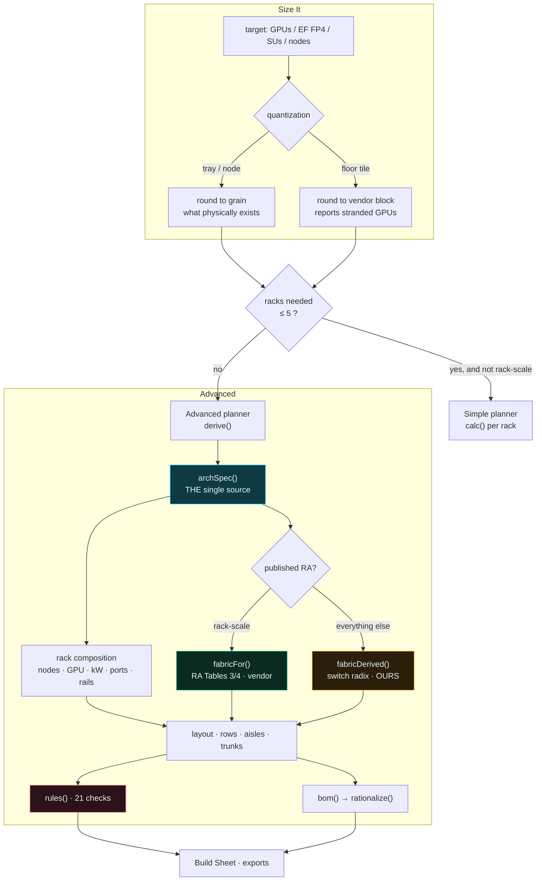
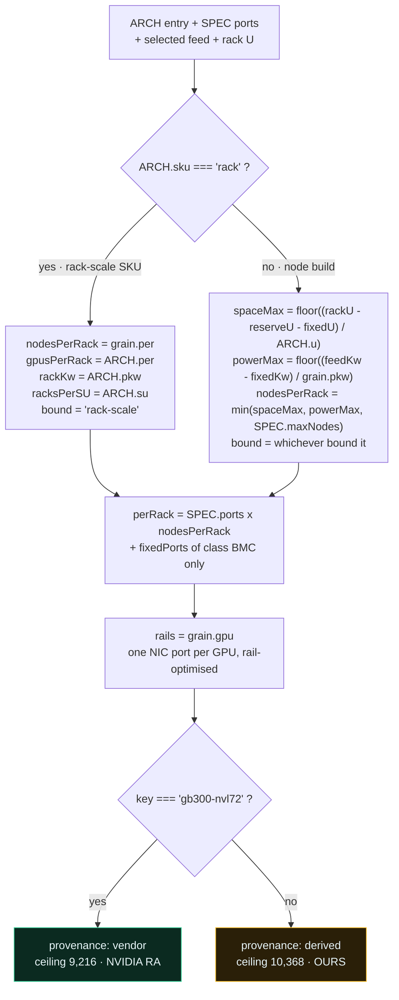
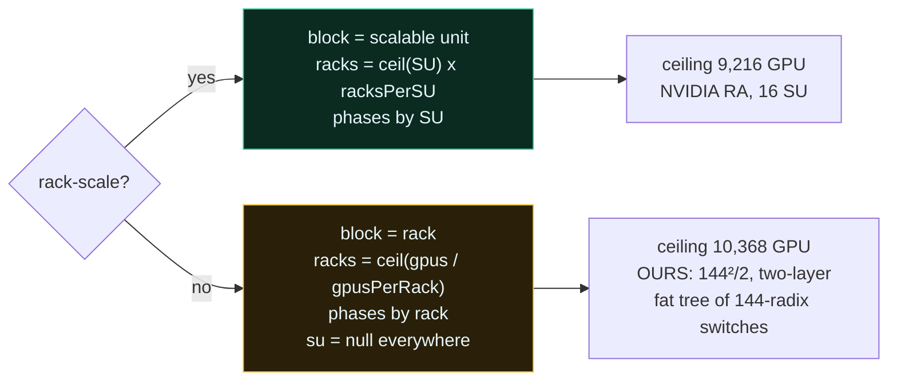
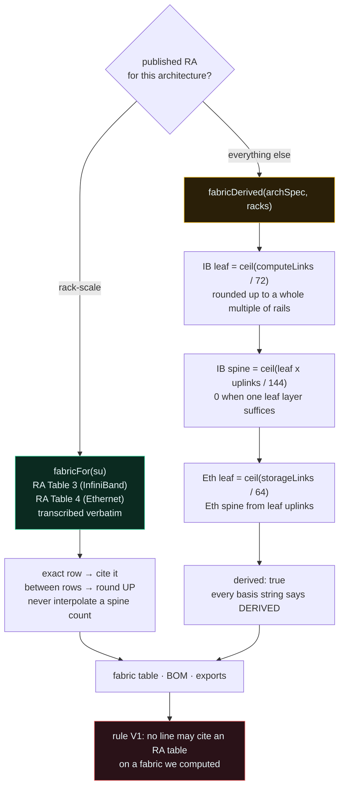
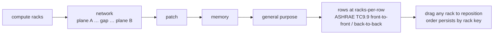

# The model — how a GPU target becomes a floor plan

## The bug this design exists to prevent

Until `e357a97`, the Advanced planner took an architecture and used it for a vendor tag and
a label. Every number downstream was a GB300 NVL72 constant: 8 racks per scalable unit,
576 GPU per SU, 72 GPU and 142 kW a rack, a literal `{compute:72, storage:36, bmc:27,
mgmt:18}` port topology, 4 rails.

So you could build a Penguin Relion at scale and receive an NVL72 floor plan with Penguin's
name on it. The tool was honest about it — it threw a dialog saying the layout would not be
what you asked for — but a disclaimer is not a feature.

The fix is one object, `archSpec()`, that every downstream number reads.

---

## Top-level flow



---

## `archSpec()` — the single source

Everything that used to be an NVL72 constant now comes from here.



### The non-regression anchor

For `gb300-nvl72` this derivation must reproduce the constants it replaced, **exactly**.
It does, and that is checked by `scripts/adv-fingerprint.mjs`:

| | before | after |
|---|---|---|
| compute racks | 64 | 64 |
| perRack | `{72, 36, 27, 18}` | `{72, 36, 27, 18}` |
| total links | 14,462 | 14,462 |
| fabric | 64 leaf / 36 spine | 64 leaf / 36 spine |
| rails | 4 | 4 |

### One subtlety that bit, twice

`perRack` folds `SPEC.fixedPorts` **for class `bmc` only**. The SPEC's fixed `mgmt` entry
is the in-rack SN2201 OOB *uplink*, and `derive()` already counts that as `oobUp`. Folding
it in both places bills the OOB uplinks twice:

```
fold ALL fixedPorts → {compute:72, storage:36, mgmt:20, bmc:27}   MISMATCH
fold bmc only       → {compute:72, storage:36, mgmt:18, bmc:27}   MATCH
```

And `nodeU` is the height of the thing the rack is **full of** — `SPEC.nodeU` (1U) for a
rack-scale tray, `ARCH.u` for a node. Reading `ARCH.u` for rack-scale gives 48, the height
of the whole *cabinet*, which made rule P1 compute 18 × 48U into a 44U rack and fail every
NVL72 build.

---

## Rack power is a feed, not a number

A free-text kW box lets somebody type 137 and receive a floor plan no electrician can
deliver. Capacity is arithmetic on a breaker:

```
amps    = kW × 1000 / (V × √3 × pf)     ← calc(), the simple planner, unchanged
breaker = nextBreaker(amps / 0.8)       ← 80% continuous derate
────────────────────────────────────────────────────────────────────────────
kW      = A × 0.8 × V × √3 × pf         ← the feed ladder, the same relation inverted
```

Running it in both directions from one relation is what stops the two planners disagreeing
about what a 250 A feed carries. `pf = 0.98`, derate `0.8`.

**The default is 300 A, not 250 A.** 415 V 3φ 250 A derates to 140.9 kW, which *looks* like
the NVL72's 142 kW and is 1.1 kW short of it. Rule E1 fails it, correctly.

**Capacity feeds sum; redundancy feeds do not.** Under 2N each path carries the whole load
alone, so two 250 A feeds in 2N buy resilience, not headroom. Rule E2 enforces the
distinction — conflating them is how a rack gets commissioned onto a breaker that trips.

### What the feed actually changes

Nodes per rack is `min(space, power)`, and *which* bound it is reported, not just consumed:

| feed | Relion 4U/14 kW | Altus 4U/10.5 kW | DGX B300 10U/14 kW | XE9680L 4U/10 kW |
|---|---|---|---|---|
| 300 A · 169.1 kW | 11 space | 11 space | 4 space | 11 space |
| 250 A · 140.9 kW | **10 POWER** | 11 space | 4 space | 11 space |
| 200 A · 112.7 kW | **8 POWER** | **10 POWER** | 4 space | 11 balanced |
| 100 A · 56.4 kW | **4 POWER** | **5 POWER** | 4 balanced | **5 POWER** |

At a generous feed everything 4U lands at 11 — 44 usable U ÷ 4 — and that is the honest
answer, not a bug. Turning the feed down is what makes power bite.

---

## The scalable unit — why we size on racks, and what that does *not* claim

NVIDIA publishes the GB300 NVL72 scalable unit, the 8-racks-per-SU figure, and RA Tables 3
and 4. They publish **none of that** for a Relion or an Altus.

Two options existed. Derive an NVL72-shaped SU from the fabric and keep the vocabulary
everywhere, or size those builds on racks.

**We size on racks.** A number we invented, sitting in a slot NVIDIA owns, reads as
NVIDIA's however it is badged. Non-rack-scale builds size directly on **racks**, and every
surface says so — the UI, the BOM basis strings, the CSV, the workbook and the JSON, where
`scalable_units` is `null` and `compute_racks` carries the answer instead.

### A correction worth keeping visible

The first version of this document said those architectures have **no scalable unit**. That
was wrong, and it was wrong about the hero product.

**Penguin publishes one: the OriginAI pod.** Checked 2026-08-10, and two figures are live
on penguinsolutions.com at different dates:

| Source | Figure |
|---|---|
| OriginAI product page (current) | a **1/4-pod entry configuration of 64 GPUs**, scaling to **90+ pods and over 24,000 GPUs** |
| 2024 OriginAI expansion release | pre-validated **1-pod, 4-pod and 16-pod** configurations spanning **256 to more than 16,000 GPUs** |

They do not reconcile to a fixed GPUs-per-pod — 16 pods at 256 GPUs is 4,096, not 16,000 —
which says a pod is a **modular rack building block** whose GPU count depends on what is in
the racks, not a constant. Both are recorded with their dates rather than resolved by
picking one, because picking one silently is how a superseded figure outlives its
generation.

Neither is modelled yet. So the honest claim is: *this tool sizes on racks and does not snap
to Penguin's pod boundaries*, which means a build here can land **between** pre-validated
configurations. Rule **V2** says exactly that, by name, on every Penguin build.

The general lesson, since it caused the error: **"we do not model X" and "the vendor does
not publish X" are different claims**, and the second one needs more than one page of a
vendor site before you make it. `VENDOR_SU` in the source records what each vendor
publishes, with where it is stated — and an absent entry means *we have not checked*, not
*nothing exists*.



---

## Fabric: read it, or derive it and say so



Radix arithmetic, stated so it can be argued with:

- **IB leaf** — Q3400-RD is 144×800G. Rail-optimised runs half down, half up: 72 downlinks
  per leaf. Leaf count rounds **up to a whole multiple of rails**, because a rail landing
  on a fraction of a leaf is not rail-optimised.
- **IB spine** — each leaf offers `ibUplinksPerLeaf` uplinks; a 144-port spine absorbs 144
  of them. One leaf layer needs no spine at all, and buying one would be cost with no
  topology behind it.
- **Ethernet** — SN5600D at 64 ports, same shape, storage and in-band separately.

One corroboration worth stating and not over-reading: at 1,152 GPU the derived arithmetic
independently lands on NVIDIA's Table 3 row — 16 leaf, 8 spine. That is one row. It is
encouraging, not proof.

### Provenance is not one flag

`archSpec().provenance` describes the **rack**. `f.derived` describes the **fabric**. They
differ, and conflating them produced a false alarm:

| | rack composition | fabric |
|---|---|---|
| GB300 NVL72 | NVIDIA — vendor | NVIDIA RA — vendor |
| Dell XE9712 | **Dell's cabinet** — vendor-published, but NVIDIA publishes no RA for it | NVIDIA's NVL72 SuperPOD fabric — genuinely RA |
| Relion / Altus / DGX | ours | ours |

Rule V1 is scoped to the **fabric**, because that is the precise claim: an RA table may be
cited only when the counts were read from one.

---

## Layout

Only the racks you fill are drawn. Padding survives in exactly one place, because there it
encodes a rule rather than tidiness: the two network planes are pushed to opposite ends so
a shared rack, patch field or PDU pair cannot take both — the difference between redundancy
and paperwork.



Rows are laid front-to-front and back-to-back per ASHRAE TC9.9, so aisles alternate cold,
hot, cold. Orientation is per-row and decides which edge cables leave from, so it is a
model value and not a decoration.

Reach is horizontal run **plus the vertical tray rise** — up, over and down. That is the
term people leave out and then discover their 3 m DACs do not reach.

---

## Where each piece lives

Single file, `index.html`, zero dependencies. The advanced planner is one IIFE.

| Function | Does |
|---|---|
| `archSpec()` | rack composition from the architecture and the feed — the single source |
| `feedKW()` / `FEEDS` | the breaker ladder and its capacity arithmetic |
| `fabricFor(su)` | RA Tables 3/4, transcribed |
| `fabricDerived(as, racks)` | switch counts from radix — ours |
| `derive()` | the whole model: racks, links, layout, floor, trunking |
| `rules(d)` | the 21 consistency checks |
| `bom(d)` → `rationalize()` | line items with stable part identity |
| `elevation(kind, d)` / `rearBands(r, d)` | front nameplates, rear composition |
| `window.__ADV_MODEL()` | the derived model, for exports and harnesses |
| `window.__BOM()` | `penguin-bom/1` for an ordering system |

## Harnesses

| Script | Asserts |
|---|---|
| `assert-controls-move-the-model.mjs` | every control moves the model, or is declared presentational |
| `assert-model-consistency.mjs` | 48 configurations coherent; every rule can be driven to FAIL |
| `adv-fingerprint.mjs` | the NVL72 path did not move — diff two runs |
| `probe-arch.mjs` | each architecture produces a *distinct* composition |
| `probe-bom.mjs` | every BOM line is orderable-shaped, and nothing derived cites an RA table |

Run them from a directory with Playwright installed:

```
node scripts/assert-model-consistency.mjs --verbose
node scripts/adv-fingerprint.mjs > before.json      # then make a change
node scripts/adv-fingerprint.mjs > after.json && diff before.json after.json
```
