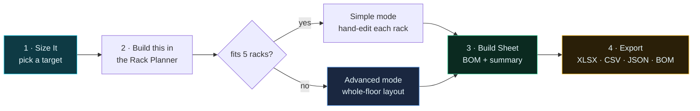

# Using the sizer

Open `index.html`, or the hosted page at
**[penguinai.dugganusa.com](https://penguinai.dugganusa.com)**. There is no account, no
server and no sync — everything runs in your browser and nothing is uploaded. A partner
sizing three competitors' estates should not be uploading any of it to us.

The cost of that choice: **clearing site data loses your saved configurations**, so the
export is the backup.

---

## The five-minute version

---

## 1 · Size It — what are you building?

Set **one** target and everything else follows. The target selector takes:

| Target | Meaning |
|---|---|
| **GPUs** | a raw accelerator count |
| **EF FP4** | dense FP4 exaFLOPS (sparse is roughly 2×) |
| **SUs** | scalable units — only meaningful for rack-scale architectures |
| **Nodes** | nodes or trays, depending on quantization |

Then pick **quantization**, which is the honest disagreement this tab exists to show:

- **Tray / node** — size to the smallest thing that physically exists inside the box
- **Floor tile** — round up to the vendor's purchasable block, which is what NVIDIA's own
  sizer does

The difference is reported as **stranded GPUs**: accelerators you buy because of rounding
and did not ask for, with the capex that goes with them. On a rack-scale SKU the floor
tile is the honest answer — NVIDIA does not list a partially populated NVL72 rack — so
treat tray counts as a planning and BOM figure and confirm partial population with your
rep before it becomes a quote.

Six architecture cards recalculate live. **Penguin Relion XE4418GTS-DTC** and **Altus
XE4318GTS-DTC** lead; Relion carries the *best $/GPU density* badge.

Every economic constant on the left is editable — per-GPU capex, $/kWh, PUE, maintenance,
cloud rate, utilization, TCO years. Drop real numbers in and you move from sizing-grade to
procurement-grade. Until you do, they are estimates.

**`⚙ Build this in the Rack Planner →`** on any card carries that architecture and GPU
count across. Where it lands depends on size: a build that fits five racks goes to Simple
mode; anything larger goes to Advanced. Both lay out the architecture **as itself**.

---

## 2 · Rack Planner

### Simple — up to 5 racks

Hand-configure individual racks. Per-rack architecture, rack U and reserved U, voltage and
phase, power factor, redundancy, direct-to-chip liquid fraction, air and water ΔT, cable
speeds and lengths. You get breaker sizing to the next real breaker, an IEC/NEMA connector,
CFM and litres-per-minute loop flow, populated weight, and a SKU-rationalized cable BOM.

Use this when the detail per rack matters more than the floor.

### Advanced — whole floor

Two selectors sit above everything else, because they set the two numbers every other
figure depends on.

**Architecture.** What the rack is full of. Changing it changes nodes per rack, GPUs per
rack, kW per rack, rails, the per-rack port topology, the elevation, the rear view and the
BOM. It is not a label.

**Rack feed.** Rack power is a *feed*, not a number you type. Each entry derives its own
capacity from a real breaker at a real voltage with an 80% continuous derate:

| Feed | Capacity | Note |
|---|---|---|
| 208 V 3φ 60 A | 16.9 kW | legacy air-cooled hall |
| 415 V 3φ 60 A | 33.8 kW | common high-density air |
| 415 V 3φ 100 A | 56.4 kW | rear-door exchanger / liquid-assist |
| 415 V 3φ 200 A | 112.7 kW | direct-to-chip liquid |
| 415 V 3φ 250 A | 140.9 kW | **does not carry a 142 kW NVL72** — 1.1 kW short |
| **415 V 3φ 300 A** | **169.1 kW** | default — carries an NVL72 with margin |
| 415 V 3φ 400 A | 225.4 kW | busway tap-off |
| 48 V DC busbar | 18.0 kW | OCP ORv3 **base** spec |

The line under the selectors tells you what your pick actually did — for example
*11 nodes · 88 GPU · 154 kW per rack (space-limited — 11 by 44U usable, 12 by the feed) ·
sized on racks, not on the OriginAI pod Penguin Solutions publishes — that is not modelled
here yet — `derived`*.

Below that, the **consistency panel** — 21 rules across electrical, fabric, cable reach,
space and provenance, of which 18 apply to every build and three only when relevant. It
sorts FAIL first, then WARN, then PASS, so you never have to hunt for the thing that blocks
the build. Read it before the exaFLOPS: a build that cannot be energised or cabled should
not be a footnote. See **[BUSINESS-RULES.md](BUSINESS-RULES.md)**.

Then the controls, all live:

Five selectors sit above the numeric controls: **architecture**, **region**, **rack feed**,
**PDU orientation** (0U vertical or 1U horizontal — horizontal costs rack U), **fabric tiers**
(leaf only or leaf + spine) and **rack height** (42U / 48U / 52U).

| Group | Controls |
|---|---|
| Scale | target GPUs, site power budget, racks per row, reserved U, feeds per rack |
| Physical | floor rating (kg/m²), node weight override |
| Cabling | cable run to leaf (m), spares % |
| Fabric | IB uplinks per leaf (72 = non-blocking) |
| Tiers | MemoryAI per block (0 = out) |

Everything below reflows: the wiring diagram (drag any rack to reposition it), rack
elevations, the naming scheme with field-limit checks, the cable plant and the BOM.

Click any rack tile to expand it. **Front** is hardware nameplates. **Rear** is the
composition — cards grouped by interface count, with the labelled cables that land on
them. The right-hand column names every device and every port, generated from the same
port topology the BOM bills.

---

## 3 · Build Sheet

Rows and aisles, a per-rack manifest, the phased buildout, the bill of materials, the
**BOM summary**, and the sovereign asset-tagging taxonomy.

The BOM summary is the part to read before you send anything to procurement: order-line
count, total order quantity, how many lines have no published part number, and whether any
consistency rule failed. See **[BOM-AND-ORDERING.md](BOM-AND-ORDERING.md)**.

---

## 4 · Exports

| Button | Contents |
|---|---|
| **Workbook (XLSX)** | multi-sheet, pivot-shaped: racks, rows/aisles, phases, BOM, naming, provenance |
| **Build sheet (CSV)** | one row per rack, denormalized — drops straight into a pivot |
| **Full build (JSON)** | the whole derived model |
| **BOM for ordering (JSON)** | `penguin-bom/1` — stable part ids, vendor, MPN, UoM, provenance, rule verdicts |

Every export carries the **partner / customer / project** identity you set at the top of
Size It, so a file is attributable without being renamed by hand.

In the workbook, anything **amber** is ours, assumed, extrapolated or unverified. Green is
vendor-published. That colouring is generated from the basis text, not applied by hand.

---

## Saving your work

**Save this configuration as…** snapshots every tab's state under a name. Configurations
never leave the browser. **Export configuration** writes a `penguin-config/1` JSON file —
that file is your backup, and the import refuses anything that is not that exact format
rather than best-effort parsing a build configuration.

---

## Two things worth knowing before a customer sees the output

**Derived power is flattered.** Where a vendor publishes only a PSU rating, we derive node
power as (GPU count × the silicon vendor's published accelerator TDP) + ~2 kW host. Ideal
TDP arithmetic tends to land *under* a real measured figure. Put a Redfish-measured draw in
before you take it anywhere.

**A derived composition is not a blessed configuration.** Rule V2 says this on the face of
every derived build. Penguin and Dell publish *validated* configurations — specific node
counts, cooling loops and fabric layouts they will support. This tool does not have that
list. Confirm the composition with the vendor before it becomes a quote.
